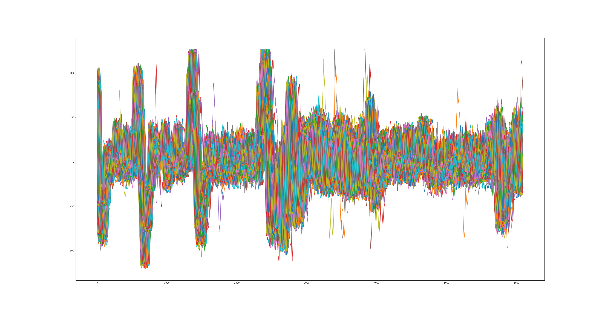
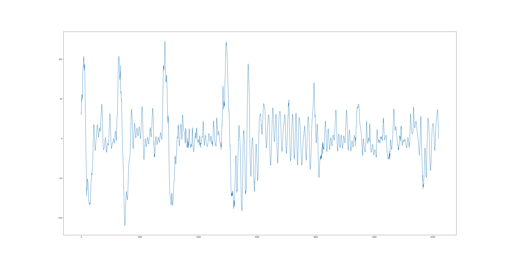
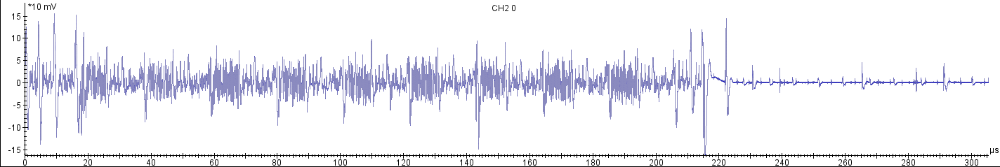
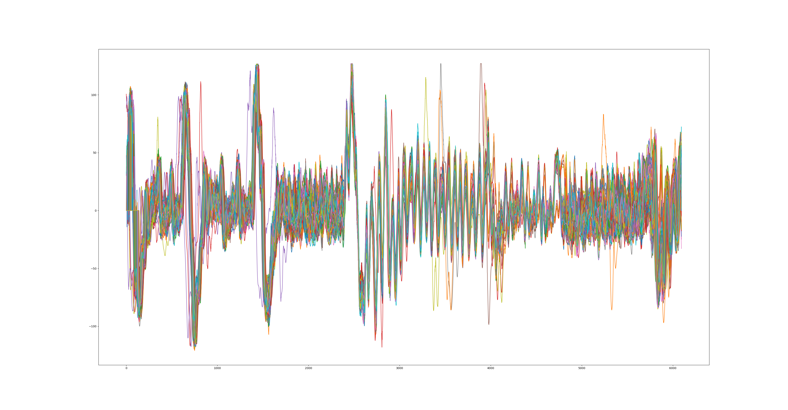

Usage
-----

Traces are given in Matlab format and in Riscure TRS format.

TRS has a TLV header:

```
41 04 0x0000012c => number of traces = 300
42 04 0x000017cf => number of samples per trace = 6095
43 01 14         => samples in floating point, 4 bytes
44 02 0x0020     => crypto data: plaintext + ciphertext
...              => we can safely ignore the other tags
5f 00            => end-of-TLV marker
```

The samples are following, one trace after the other one.

A little helper has been added to Daredevil to convert these traces: https://github.com/SideChannelMarvels/Daredevil/blob/master/trs2daredevil.py

```
trs2daredevil traces.trs
```

Let's plot it:

```python
#!/usr/bin/env python3

import matplotlib.pyplot as plt
import numpy as np

ntraces=300
nsamples=6095
alltraces=[]
with open('traces.trs.traces', 'rb') as trs:
    for i in range(ntraces):
        alltraces.append(np.fromfile(trs, dtype=np.float32, count=nsamples))

for i in range(300):
    plt.plot(alltraces[i])
plt.show()
```



They are obviously misaligned.

Looking at a single trace



and comparing it with the overview



We see the samples are corresponding to the first rounds.
We see also in the overview that there are 10 rounds.

So this is very probably an AES128 and we will have to attack the first rounds based on the inputs.

Let's assume it's an encryption.

To realign traces, we'll use [qscat](https://github.com/FdLSifu/qscat) which has been updated during the challenge to cooperate with Daredevil.
This write-up was written based on qscat commit e69ca7e25e20cbe0a7528d9911f02965429c7de6.

It requires the traces to be in separate files.

```python
#!/usr/bin/env python3

ntraces=300
nsamples=6095
with open('traces.trs.traces', 'rb') as trs:
    for i in range(ntraces):
        with open("traces.trs.traces_%04i" % i, 'wb') as out:
            out.write(trs.read(nsamples*4))
```

Let's launch scatool (qscat).

* Open the 300 trace files.
* Display All
* Synchronization

Actually it's not possible to realign the traces on the full window, so we've to try at different positions on remarkable features.
When realigning based on the third big wave, we'll get interesting results:

* Synchronization
  * Reference Pattern: 2200 to 2500
  * Window Search: -150 to +150
  * Add Step
  * Run synchro
* Save file, "realigned", binary

The result:



Let's feed the realigned traces to Daredevil:

```
sed 's/trace=traces.trs.traces/trace=realigned/' traces.trs.config > realigned.config
daredevil -c realigned.config
...
Most probable key sum(abs):
1: 8.3946: cafebabedeadbeef0001020304050607
```
